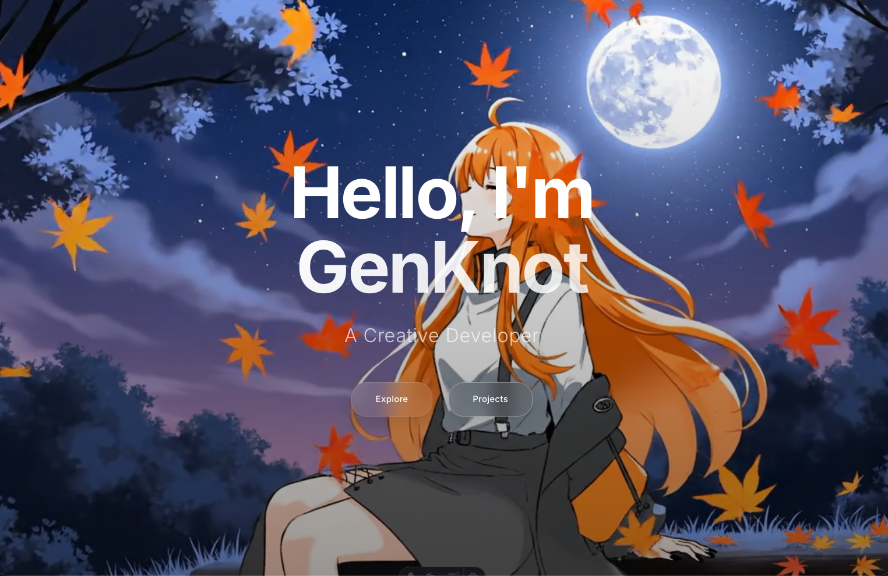

Hey there! 👋



This is just a portfolio site I'm building for fun with Astro. Honestly, I started this project because:

1. I discovered Perplexity can generate videos, which I found super interesting
2. I saw Astro's ads and thought it looked cool
3. I wanted to create a simple personal profile page

So I decided to combine these ideas and make something with it.

## What's in here?

- **Hero Section**: Background videos that loop (I use Perplexity-generated videos!)
- **About Me**: Just some info
- **Skills**: Yes
- **Projects**: Maybe some work
- **Contact**: Nothing there

## Status

This project is **incomplete** but usable. I'm not sure if I'll update it later - I was just having fun with it. If you have better videos to use, feel free to drop them in the `/public` folder.

## Run it

```bash
npm install
npm run dev
```

Then open http://localhost:4321

## Build

```bash
npm run build
```

That's pretty much it. Nothing fancy, just a simple portfolio site made for fun.

---

Built with ❤️ using Astro